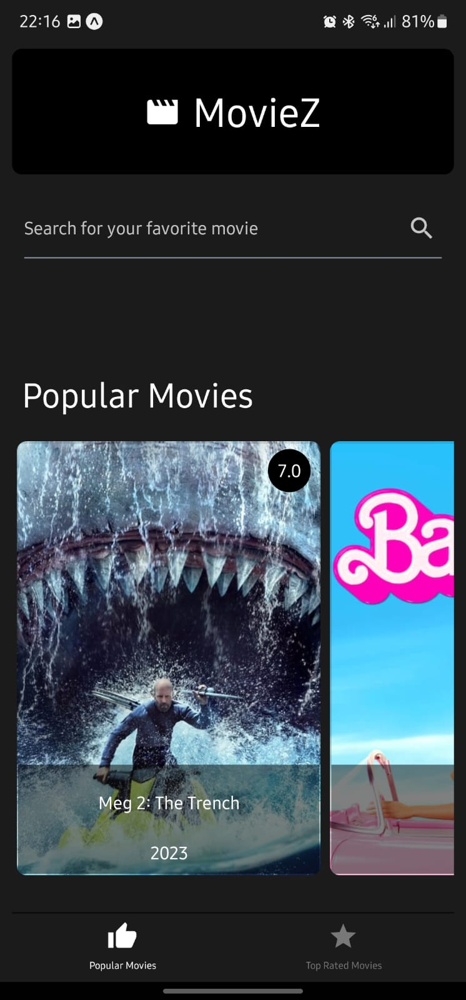

# RNMovieApp

## Description

> This is a React Native project for a movie app.
>
> It's purpose is to satisfy the requirements of a technical test.
>
> This project was bootstrapped with [Expo](https://expo.io/). and uses **TypeScript**.

## Test Requirements

> Build a simple react-native app that displays a list of movies. The app should have at least two tabs: one for popular movies and another for top rated movies. The app should use the [The Movie DB API](https://developers.themoviedb.org/4/getting-started) to fetch the movies.
>
> The app should also use react-context to manage the app state and allow the user to change the sort order of the movies (by release date, by rating, etc.).

### Main Features

- [x] Use functional components and the React Hooks API
- [x] Use the _useContext_ hook to manage the app state with react-context
- [x] Use the _useEffect_ hook to fetch the movies when the app loads and when the sort order changes
- [x] Use the _fetch_ function to make the HTTP requests to the movie API
- [x] Use async/await to handle the async logic
- [x] Use the _react-navigation_ library to implement the tabs
- [x] Use the _react-native-elements_ library to style the components

### Bonus Features

- [x] Add a search feature that allows the user to search for movies by title.
- [x] Add a movie details page that displays more information about the movie (e.g. cast, crew, synopsis, etc.).
- [x] Offline support using the _react-native-offline_ library.

## Installation and Usage

> 1. Clone or download the repository
> 2. Run `npm install` to install the dependencies
> 3. Add a `.env.local` file to the root of the project with the content described in the `.env.example` file.
> 4. Run `npm start` to start the _expo_ server and follow the instructions to run the app on a simulator or a real device.

## Screenshots

  
  
  
  

---

## Author

**Bruno Pais**

 
